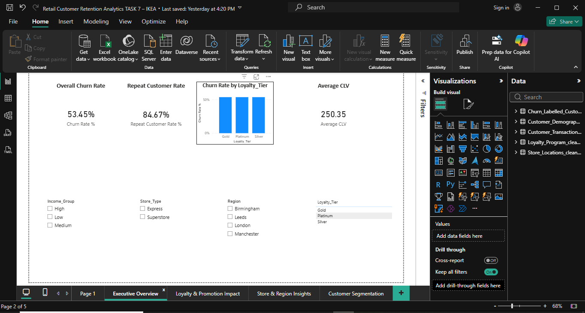
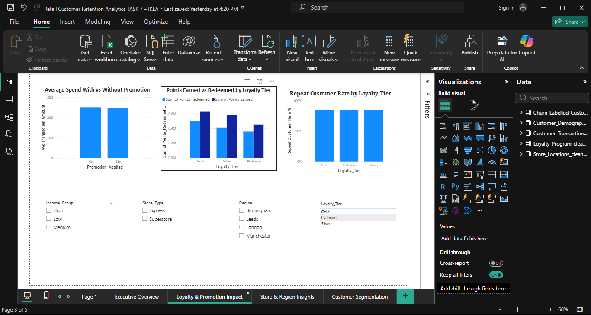
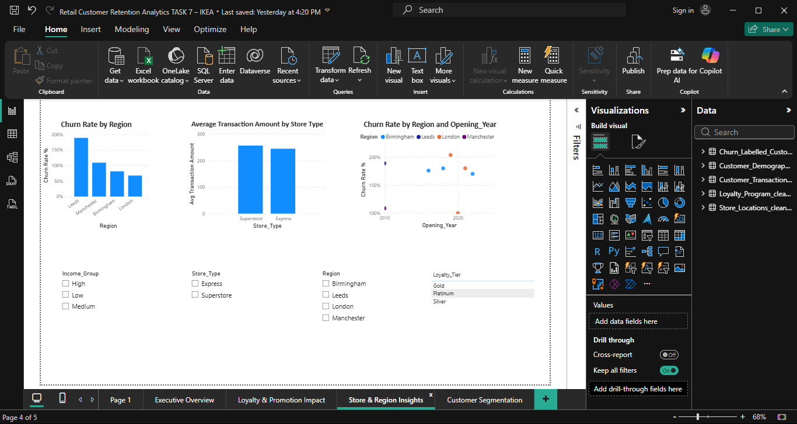
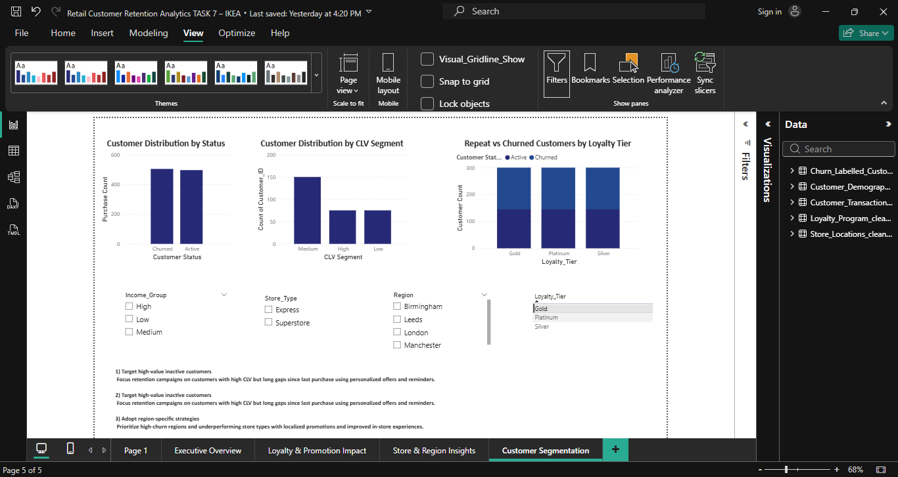
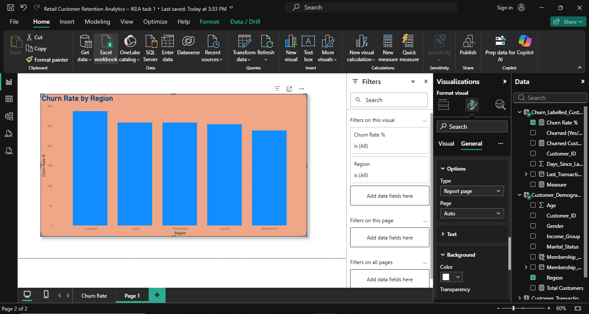
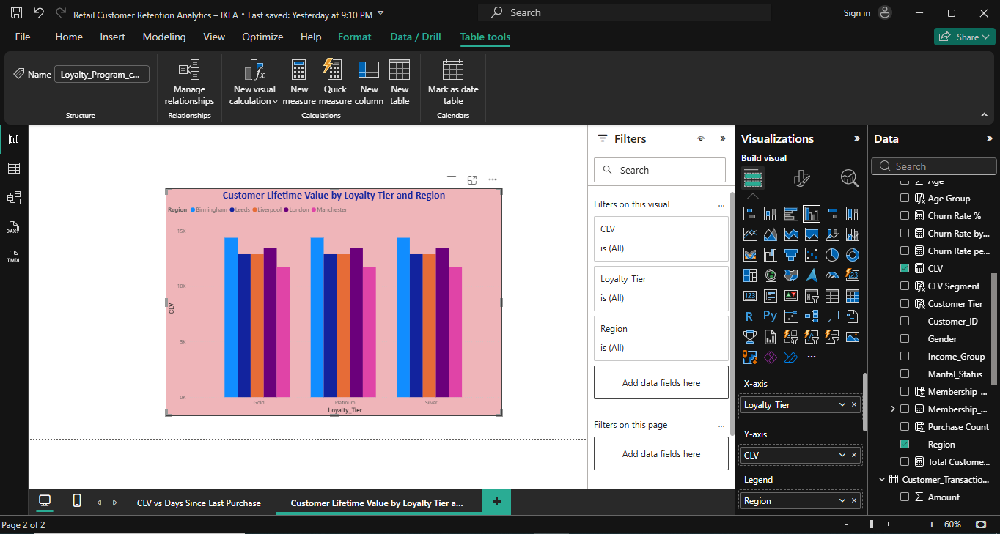
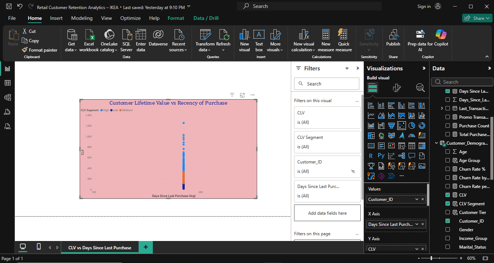

# 📊 Power BI Customer Retention Analytics – IKEA

This project analyzes **customer churn, retention behavior, and loyalty program impact** using Power BI.  
The objective is to identify **why customers churn and what factors influence retention**, helping businesses improve long-term customer value.

The dashboard provides insights into:

- Customer churn patterns
- Loyalty program performance
- Customer Lifetime Value (CLV)
- Promotion effectiveness
- Regional store performance

---

# 📂 Project Structure

---

# 📊 Dashboard Overview

## Executive Overview

Key KPIs displayed:

- Overall Churn Rate
- Repeat Customer Rate
- Average Customer Lifetime Value
- Churn Rate by Loyalty Tier

---

# 🎯 Loyalty & Promotion Impact

Insights:

- Promotion usage impact on purchasing behavior
- Loyalty points earned vs redeemed
- Repeat customer rate by loyalty tier
- Average spending with and without promotions

---

# 🏬 Store & Region Insights

Key insights:

- Churn rate by region
- Average transaction value by store type
- Store opening year vs churn rate
- Regional performance comparison

---

# 👥 Customer Segmentation

Customer segmentation based on:

- CLV segments (High / Medium / Low)
- Customer status (Active vs Churned)
- Loyalty tier behavior
- Purchase patterns by age group

---

# 📈 Advanced Analytics

### Churn Rate by Region

---

### Customer Lifetime Value Analysis

---

### CLV vs Days Since Last Purchase

---

# 🧠 Key Business Insights

Key findings from the analysis:

1. Customers with **higher loyalty tiers show lower churn rates**.

2. **Promotions significantly increase average purchase value**.

3. Some **regions show higher churn**, indicating potential service or engagement issues.

4. Customers with **higher CLV purchase more frequently**.

5. **Newer stores tend to have higher churn rates**, suggesting a need for better customer engagement strategies.

---

# 🛠 Tools Used

- Power BI  
- DAX (Data Analysis Expressions)  
- Data Modeling  
- Data Visualization  

---

# 📌 Skills Demonstrated

- Customer Churn Analysis
- Customer Lifetime Value (CLV) Analysis
- KPI Dashboard Design
- Business Intelligence Reporting
- Data Modeling
- Data Visualization

---

# 🚀 Project Outcome

This dashboard helps businesses:

- Understand customer churn behavior
- Improve loyalty program strategies
- Identify high-value customers
- Optimize marketing promotions
- Improve regional store performance

